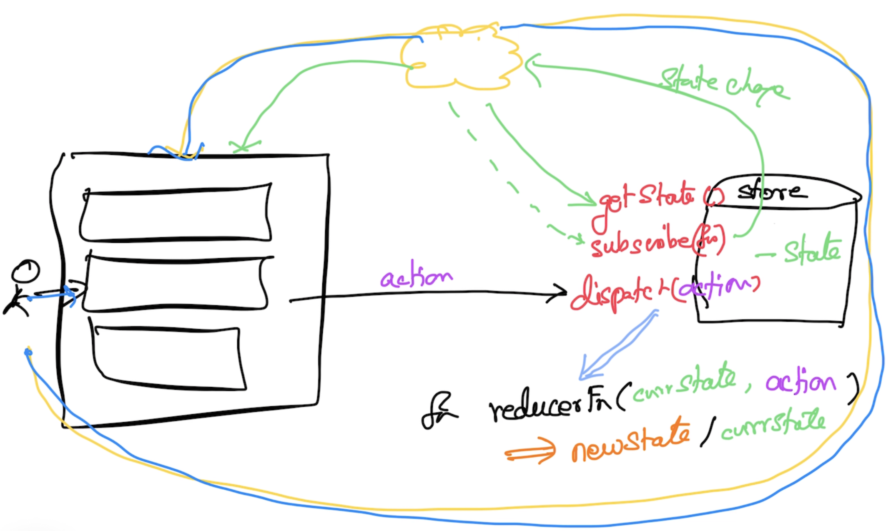

# Magesh Kuppan
- 

## React.js + Redux

## Schedule
- Commence      : 9:00 AM
- Tea Break     : 10:30 AM (20 mins)
- Lunch Break   : 12:30 PM (1 hour)
- Tea Break     : 3:00 PM (20 mins)
- Wind up       : 4:20 PM 

## Methodology
- No powerpoint
- Discuss & Code

## Repository
- https://github.com/tkmagesh/shell-react-feb-2024

## Software Requirements
- Node.js (LTS)
- Visual Studio Code
- Chrome Browser

## References
- https://bit.ly/react-videos
- https://bit.ly/javascript-training-videos

## RIA (Rich Internet Applications)

## Real World React Applications
- https://github.com/jeromedalbert/real-world-react-apps

## JavaScript Concepts
### Pure Function
- A function with NO side effects
- Is a function whose invocation can be replaced with the result of the function without affecting the outcome
- example:
```
var isPrime = (function(){
    var cache = {};
    function isPrime(no){
        console.log(`processing ${no}`)
        for (var i = 2; i <= (no/2); i++ )
            if (no % i == 0)
                return false;
        return true;
    }
    return function(no){
        if (!cache.hasOwnProperty(no)){
            cache[no] = isPrime(no)
        }
        return cache[no];
    }
})()
```

## State
### Application State
- Any data that need to accessed throughout the application
- Typically this represents the domain of the application
- DO NOT maintain this state in the component
### UI State
- Assists in the presentations needs of the component
- Any change in this data MIGHT NOT to be recognized by other parts of the application
- Feel free to maintain this data in the component

## State Management 


## ES6 Modules
- Everything defined in a file (js/jsx/ts) is considered 'private' by default
- All public entities have to be explicitly exported
- To use any public entity they have to be explicitly imported

## Components
### Smart/Container components
- Communicate to redux infrastructure to prepare the data & create action dispatchers
- Cascade the data & action dispatchers to the presentation components
- DO NOT do any presentation task
### Presentation/Dumb components
- DO NOT communicate with redux infrastructure
- Receive data & action dispatchers from Smart components and present them to the user
### Guideline
- Fewer components & as many presentation components as required

## Redux Middleware
- Used to encapsulate any logic that is common across actions